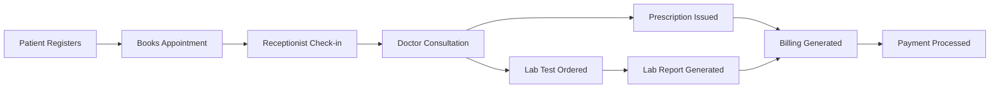

# 🏥 Hospital Management System - Complete Healthcare Platform

<div align="center">


**A comprehensive, full-featured hospital management platform streamlining patient care, doctor management, appointments, billing, and more — all in one system.**

[Features](#-features) • [Installation](#-installation) • [Usage](#-usage) • [Tech Stack](#-tech-stack) • [Project Structure](#-project-structure)

</div>

---

## 🌟 Features

### For Patients
- 📋 **Patient Registration** - Easy onboarding with complete medical profile creation
- 📅 **Appointment Booking** - Schedule appointments with available doctors
- 💊 **Prescription Access** - View and download prescriptions digitally
- 🧪 **Lab Reports** - Access diagnostic and lab reports online
- 💳 **Billing Overview** - View invoices and payment history
- 🔔 **Notifications** - Stay updated on appointments and health updates

### For Doctors
- 👤 **Doctor Profiles** - Manage specialization, schedule, and availability
- 📋 **Patient Records** - Access complete patient history and visits
- 💊 **Prescriptions** - Issue and manage digital prescriptions
- 📅 **Appointment Management** - View daily and weekly schedules
- 🧪 **Lab Report Review** - Order and review diagnostic reports
- 📊 **Dashboard** - Overview of daily workload and patient metrics

### For Receptionists
- 📝 **Patient Registration** - Register new patients and manage records
- 📅 **Appointment Scheduling** - Book, reschedule, and cancel appointments
- 💳 **Billing Management** - Generate invoices and process payments
- 🔔 **Notifications** - Send updates to patients and staff
- 📋 **Services Management** - Manage available hospital services

### For Admins
- 🏥 **Full System Control** - Manage all users, roles, and departments
- 👨‍⚕️ **Doctor Management** - Add, update, and manage doctor profiles
- 📊 **Dashboards** - Comprehensive analytics across all hospital operations
- 🧪 **Lab Reports** - Oversee all diagnostic requests and results
- 💰 **Billing Oversight** - Monitor all financial transactions
- 🔐 **Role-Based Access** - Control permissions for all user types

### Platform Features
- 🔐 **Secure Authentication** - Role-based access control (Admin / Doctor / Patient / Receptionist)
- 📊 **Dedicated Dashboards** - Tailored views for each user role
- 🔔 **Notification System** - Internal alerts and updates across the platform
- 🎨 **Modern UI/UX** - Professional, clean interface built with HTML & CSS
- 📱 **Responsive Design** - Optimized for desktops and all screen sizes
- 🌐 **RESTful Architecture** - Clean, maintainable Django-based codebase

---

## 🚀 Quick Start

### Prerequisites

- Python 3.8 or higher
- pip (Python package manager)
- Virtual environment (recommended)

### Installation

1. **Clone the repository**
   ```bash
   git clone https://github.com/salamlakhan7/hospital_management_system.git
   cd hospital_management_system
   ```

2. **Create and activate virtual environment**
   ```bash
   # Windows
   python -m venv venv
   venv\Scripts\activate

   # macOS/Linux
   python3 -m venv venv
   source venv/bin/activate
   ```

3. **Install dependencies**
   ```bash
   pip install -r requirements.txt
   ```

4. **Run database migrations**
   ```bash
   python manage.py makemigrations
   python manage.py migrate
   ```

5. **Create a superuser (admin)**
   ```bash
   python manage.py createsuperuser
   ```

6. **Collect static files**
   ```bash
   python manage.py collectstatic --noinput
   ```

7. **Run the development server**
   ```bash
   python manage.py runserver
   ```

8. **Access the application**
   - Main site: `http://127.0.0.1:8000`
   - Admin panel: `http://127.0.0.1:8000/admin`

---

## 📖 Usage Guide

### For Patients

1. **Register** - Create your patient account with personal and medical details
2. **Book Appointment** - Browse available doctors and schedule a visit
3. **Attend Visit** - Visit the hospital; receptionist will check you in
4. **Receive Prescription** - Doctor issues a digital prescription after consultation
5. **View Lab Reports** - Access diagnostic results from your dashboard
6. **Pay Bill** - View and settle billing from the patient portal

### For Doctors

1. **Login** - Access your personalized doctor dashboard
2. **View Schedule** - Check your daily appointments and patient queue
3. **Review Patient History** - Access complete patient records before consultation
4. **Issue Prescription** - Create and assign prescriptions digitally
5. **Request Lab Tests** - Order diagnostic reports for patients
6. **Update Availability** - Manage your working hours and off days

### For Receptionists

1. **Register Patients** - Onboard new patients into the system
2. **Schedule Appointments** - Book appointments on behalf of patients
3. **Manage Check-ins** - Handle patient arrivals and waiting queues
4. **Process Billing** - Generate invoices and record payments
5. **Send Notifications** - Alert patients and staff on updates

### For Admins

1. **Login** - Access the full admin dashboard
2. **Manage Users** - Add doctors, receptionists, and manage accounts
3. **Oversee Operations** - Monitor appointments, billing, and lab workflows
4. **View Analytics** - Track hospital performance metrics
5. **Configure Services** - Add or update available hospital services

---

## 🛠️ Tech Stack

### Backend
- **Django** - High-level Python web framework
- **SQLite** - Lightweight database for development (PostgreSQL recommended for production)
- **Django ORM** - Database abstraction and query management

### Frontend
- **HTML5** - Semantic markup and page structure
- **CSS3** - Styling and responsive layout
- **JavaScript** - Interactive frontend functionality

### Key Modules
- **appointments** - Booking and scheduling logic
- **billing** - Invoice generation and payment tracking
- **dashboards** - Role-specific analytics and overviews
- **doctors** - Doctor profiles and availability management
- **labreports** - Lab test requests and result management
- **notifications** - Internal alert and messaging system
- **patients** - Patient records and medical history
- **prescriptions** - Digital prescription creation and access
- **receptionist** - Front-desk workflows and patient check-in
- **services** - Hospital service catalog management
- **users** - Authentication, roles, and account management

---

## 📁 Project Structure

```
hospital_management_system/
├── appointments/                  # Appointment booking and scheduling
├── billing/                       # Invoice generation and payment tracking
├── dashboards/                    # Role-based analytics dashboards
├── doctors/                       # Doctor profiles and availability
├── hospital_management_system/    # Project configuration
│   ├── settings.py               # Django settings
│   ├── urls.py                   # Main URL configuration
│   ├── asgi.py                   # ASGI configuration
│   └── wsgi.py                   # WSGI configuration
├── labreports/                    # Lab test requests and results
├── notifications/                 # Alert and notification system
├── patients/                      # Patient records and medical history
├── prescriptions/                 # Digital prescription management
├── receptionist/                  # Front-desk workflows
├── services/                      # Hospital service catalog
├── templates/
│   └── dashboards/               # Dashboard HTML templates
├── users/                         # Authentication and role management
├── .gitignore
├── manage.py                      # Django management script
└── README.md                      # This file
```

---

## 🔧 Configuration

### Environment Variables (Optional)

Create a `.env` file in the project root:

```env
DEBUG=True
SECRET_KEY=your-secret-key-here
ALLOWED_HOSTS=localhost,127.0.0.1
DATABASE_URL=sqlite:///db.sqlite3
```

### Production Database (PostgreSQL)

For production environments, replace SQLite with PostgreSQL in `settings.py`:

```python
DATABASES = {
    'default': {
        'ENGINE': 'django.db.backends.postgresql',
        'NAME': 'hospital_db',
        'USER': 'your_db_user',
        'PASSWORD': 'your_db_password',
        'HOST': 'localhost',
        'PORT': '5432',
    }
}
```

---

## 🎨 Features in Detail

### Patient Workflow


*If the diagram doesn't render, view on GitHub desktop or browser.*

### Role-Based Access

| Feature | Admin | Doctor | Receptionist | Patient |
|---|---|---|---|---|
| Patient Records | ✅ Full | ✅ Read | ✅ Register | ✅ Own |
| Appointments | ✅ Full | ✅ View | ✅ Manage | ✅ Book |
| Prescriptions | ✅ Full | ✅ Issue | ❌ | ✅ View |
| Lab Reports | ✅ Full | ✅ Order/View | ❌ | ✅ View |
| Billing | ✅ Full | ❌ | ✅ Process | ✅ View |
| Dashboards | ✅ Admin | ✅ Doctor | ✅ Reception | ✅ Patient |
| User Management | ✅ | ❌ | ❌ | ❌ |

---

## 🧪 Testing

Run tests with:

```bash
python manage.py test
```

---

## 🤝 Contributing

Contributions are welcome! Please follow these steps:

1. Fork the repository
2. Create a feature branch (`git checkout -b feature/AmazingFeature`)
3. Commit your changes (`git commit -m 'Add some AmazingFeature'`)
4. Push to the branch (`git push origin feature/AmazingFeature`)
5. Open a Pull Request

---

## 📝 License

This project is licensed under the MIT License - see the [LICENSE](LICENSE) file for details.

---

## 👥 Authors

- **Abdul Salam** - *Development* - [GitHub](https://github.com/salamlakhan7)

---

## 🙏 Acknowledgments

- Django community for excellent documentation and framework
- Original project by [faizarajpoot1505](https://github.com/faizarajpoot1505/hospital_management_system)
- All contributors and testers

---

## 📞 Support

For support, email salamlakhan7@gmail.com or open an issue in the repository.

---

## 🗺️ Roadmap

- [ ] Real-time notifications with WebSockets
- [ ] Telemedicine / Video consultation integration
- [ ] Advanced analytics and reporting dashboard
- [ ] Mobile app (React Native)
- [ ] Email and SMS appointment reminders
- [ ] Insurance and claims management module
- [ ] Multi-language support
- [ ] AI-powered diagnosis assistance
- [ ] Payment gateway integration
- [ ] Electronic Health Records (EHR) export

---

<div align="center">

**Made with ❤️ using Django**

⭐ Star this repo if you find it helpful!

</div>
